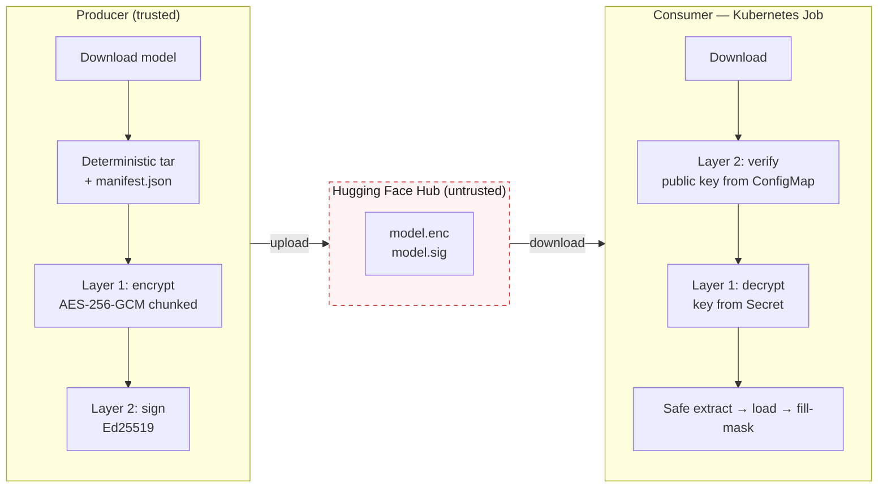
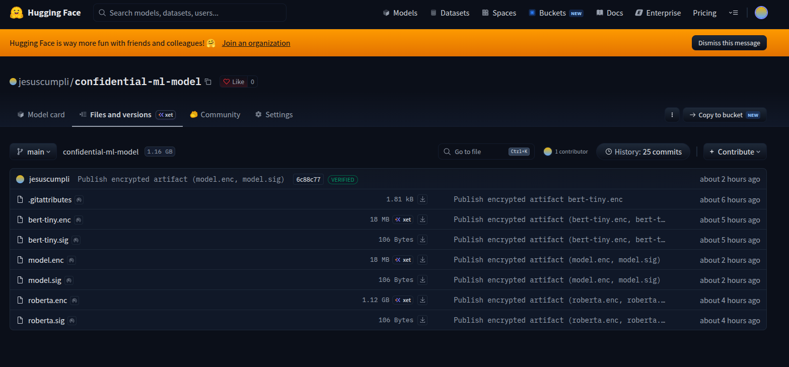
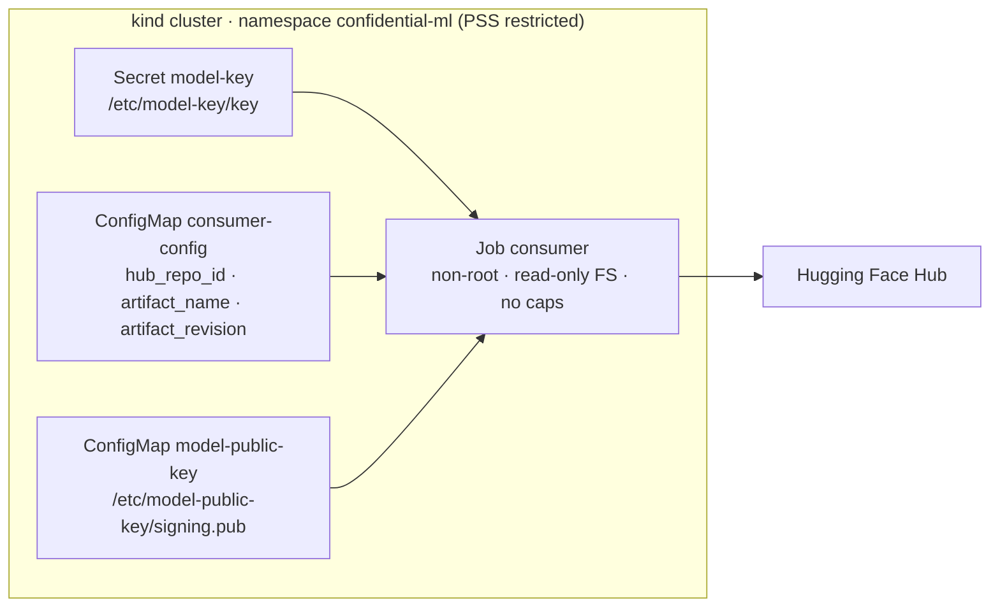
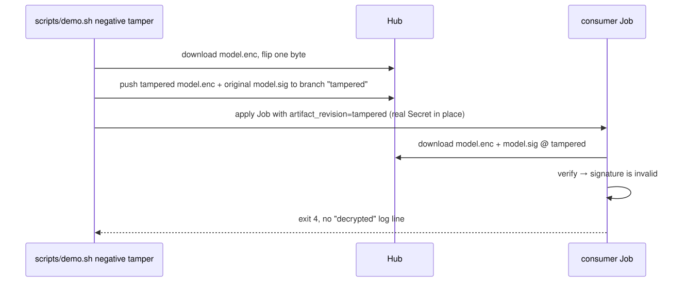
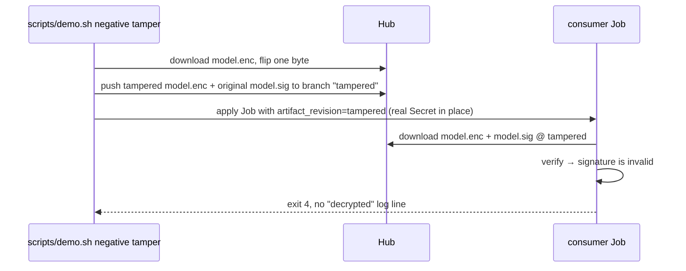

# Confidential ML Model Delivery

Deliver a Hugging Face model so that **only the intended consumer can read it** and
**only a model signed by the producer is ever run**.

- A **producer** downloads a model, encrypts it (**Layer 1**, AES-256-GCM), signs it
  (**Layer 2**, Ed25519) and uploads `model.enc` + `model.sig` to the Hugging Face Hub.
- A **consumer**, a Kubernetes Job, downloads both files, verifies the signature,
  reads the key from a Kubernetes Secret, decrypts, loads the model and runs one
  inference.
- **Layer 3** (attested key release with Confidential Containers) is designed in
  [`docs/layers.md`](docs/layers.md), not implemented.

The Hub never sees the plaintext model or a key.



<details>
<summary>Mermaid source</summary>



</details>

---

## 1. What was built

| Layer | Producer does | Consumer does | Status |
|---|---|---|---|
| **1 — Confidentiality** | deterministic tar + `manifest.json` → AES-256-GCM, chunked (format v2) → `model.enc` | key from Secret at `/etc/model-key/key` → decrypt chunk by chunk → safe extract → load → fill-mask | ✅ tested on kind |
| **2 — Authenticity** | Ed25519 over SHA-256(`model.enc`) → `model.sig`, uploaded in the same commit | public key from ConfigMap → verify **before** the key is read; any mismatch ⇒ exit 4 | ✅ tamper demo |
| **3 — Attested key** | — | key released by a KBS after TEE attestation (`CdhKeyProvider`) | 📝 design only |


Why AES-256-GCM, Ed25519 and chunked mode: they were measured against ChaCha20,
AES-GCM-SIV, XChaCha20, ECDSA, RSA-PSS and ML-DSA and ranked first; chunked keeps
memory flat for multi-GB weights. Plain-language summary with charts:
[`docs/crypto-decision.md`](docs/crypto-decision.md).

## 2. Quick start (local)

Needs Python 3.12, [uv](https://docs.astral.sh/uv/) ≥ 0.12 and a Hugging Face token
with **write** access. Replace `<user>/<repo>` with a Hub repo you own (created on
first publish, private by default).

**Install and run every quality gate**

```bash
git clone <this repository> && cd confidential-ml-model-delivery
uv sync --all-extras --all-groups --all-packages
scripts/check.sh          # ruff · mypy --strict · pytest in every member + integration
```

**Generate the keys** (into git-ignored `var/secrets/`; nothing is printed)

```bash
./scripts/gen-key.sh                # Layer 1: model.key   (32 random bytes)
./scripts/gen-signing-keypair.sh    # Layer 2: signing.key (private) + signing.pub
```

**Producer — package, encrypt, sign, publish**

```bash
export HF_TOKEN=hf_xxx
uv run producer run --key-path var/secrets/model.key \
  --signing-key-path var/secrets/signing.key --repo-id <user>/<repo>
```

<details>
<summary>Expected output</summary>

```text
INFO downloading prajjwal1/bert-tiny@main
Fetching 3 files: 100%|██████████████████████████████████████████████████████████████████████████████████████████████████████████████████████████████████████████████████████████████████████████████| 3/3 [00:01<00:00,  1.56it/s]
Download complete: : ██████████████████████████████████████████████████████████████████████████████████████████████████████████████████████████████████████████████████████████████████████████████████████████| 16.9MB, 16.1MB/s  INFO packaged 3 files (18001920 bytes) at var/artifacts/model.tar██████████████████████████████████████████████████████████████████████████████████████████████████████████████████████████████████████| 18.0MB / 18.0MB, 11.6MB/s  
INFO encrypted var/artifacts/model.tar -> var/artifacts/upload/model.enc (aes-256-gcm, chunked)
INFO signed var/artifacts/upload/model.enc -> var/artifacts/upload/model.sig (ed25519)
Processing Files (1 / 1)      : 100%|█████████████████████████████████████████████████████████████████████████████████████████████████████████████████████████████████████████████████████████████████| 18.0MB / 18.0MB, 1.24MB/s  
New Data Upload               : 100%|█████████████████████████████████████████████████████████████████████████████████████████████████████████████████████████████████████████████████████████████████| 18.0MB / 18.0MB, 1.24MB/s  
  ...rtifacts/upload/model.enc: 100%|█████████████████████████████████████████████████████████████████████████████████████████████████████████████████████████████████████████████████████████████████| 18.0MB / 18.0MB            
INFO published model.enc, model.sig to jesuscumpli/confidential-ml-model (commit 6d21e4c00d7a63b6bfe77a76240244e7646d139b)
published model.enc + model.sig to jesuscumpli/confidential-ml-model at commit 6d21e4c00d7a63b6bfe77a76240244e7646d139b
Download complete: : ██████████████████████████████████████████████████████████████████████████████████████████████████████████████████████████████████████████████████████████████████████████████████████████| 16.9MB, 16.1MB/s  
Reconstruction complete: 100%|████████████████████████████████████████████████████████████████████████████████████████████████████████████████████████████████████████████████████████████████████████| 18.0MB / 18.0MB, 11.6MB/s
```

</details>

The Hub repository after a publish — with some sample artifacts:



**Consumer — download, verify, decrypt, restore, infer**

```bash
uv run consumer --repo-id <user>/<repo> \
  --key-path var/secrets/model.key --public-key-path var/secrets/signing.pub
```

<details>
<summary>Expected output</summary>

```text
model.enc: downloading bytes: █████████████████████████████████████████████████████████████████████████████████████████████████████████████████████████████████████████████████████████████████████████████████| 18.0MB, 1.68MB/s  
model.enc: reconstructing file: 100%|█████████████████████████████████████████████████████████████████████████████████████████████████████████████████████████████████████████████████████████████████| 18.0MB / 18.0MB, 1.71MB/s  
INFO artifact model.enc (18002226 bytes)
model.sig: 100%|███████████████████████████████████████████████████████████████████████████████████████████████████████████████████████████████████████████████████████████████████████████████████| 106/106 [00:00<00:00, 334kB/s]
INFO signature model.sig verified (ed25519)
INFO decrypted artifact to plaintext package (18001920 bytes, aes-256-gcm, chunked)
INFO restored prajjwal1/bert-tiny@6f75de8b60a9f8a2fdf7b69cbd86d9e64bcb3837 (3 files, manifest verified)
INFO model loaded: BertForMaskedLM
prompt: The capital of France is [MASK].
┏━━━┳━━━━━━━━━┳━━━━━━━━━━━━━┓
┃ # ┃ token   ┃ probability ┃
┡━━━╇━━━━━━━━━╇━━━━━━━━━━━━━┩
│ 1 │ france  │       0.301 │
│ 2 │ spain   │       0.126 │
│ 3 │ germany │       0.033 │
│ 4 │ algeria │       0.032 │
│ 5 │ canada  │       0.021 │
└───┴─────────┴─────────────┘
```

</details>

**Tamper demo, local** — the signature check runs before the key is read:

```bash
uv run producer gen-signing-keypair --out /tmp/other.key      # someone else's key pair
uv run consumer --repo-id <user>/<repo> -k var/secrets/model.key \
  --public-key-path /tmp/other.key.pub; echo "exit $?"          # ⇒ exit 4, nothing decrypted
```

Useful variants: `producer config` (effective settings, no secrets), `producer run
--interactive`, `--mode one-shot` (format v1 for small models), `--public`,
`consumer --prompt "Paris is the capital of [MASK]." --metrics`, and `--help` on any
command for every flag and its environment variable.

## 3. Kubernetes demo (kind)

Needs Docker, [kind](https://kind.sigs.k8s.io/) and `kubectl`, plus the artifact
published in step 2. The consumer runs as a `Job`: the key is a Secret mounted as a
read-only file, the public signing key a ConfigMap, the repo id plain configuration.



<details>
<summary>Mermaid source</summary>



</details>

```bash
scripts/kind-setup.sh                                  # cluster + images + namespace (idempotent)
HUB_REPO_ID=<user>/<repo> scripts/demo.sh              # happy path: Job completes, prints the prediction
HUB_REPO_ID=<user>/<repo> scripts/demo.sh negative corrupt   # random key in the Secret ⇒ exit 5
HUB_REPO_ID=<user>/<repo> scripts/demo.sh negative missing   # Secret deleted ⇒ pod stuck on FailedMount
HUB_REPO_ID=<user>/<repo> scripts/demo.sh negative tamper    # flipped byte ⇒ exit 4 (needs HF_TOKEN, see below)
scripts/kind-down.sh                                   # teardown
```

`demo.sh` creates the Secret and both ConfigMaps from `var/secrets/` on every run,
applies `k8s/consumer-job.yaml`, waits and prints the logs. If the Hub repo is
private, create the read token once:
`kubectl -n confidential-ml create secret generic hf-token --from-literal=token="$HF_TOKEN"`.

<details>
<summary>Expected output — happy path</summary>

```text
==> creating Secret model-key from /opt/confidential-ml-model-delivery/var/secrets/model.key
secret/model-key created
configmap/consumer-config created
==> rendering and applying the public signing key ConfigMap from /opt/confidential-ml-model-delivery/var/secrets/signing.pub
wrote /opt/confidential-ml-model-delivery/k8s/configmap-public-key.yaml
configmap/model-public-key created
job.batch/consumer created
==> waiting for the consumer Job to complete
---- consumer logs ----
Warning: You are sending unauthenticated requests to the HF Hub. Please set a HF_TOKEN to enable higher rate limits and faster downloads.
WARNING Warning: You are sending unauthenticated requests to the HF Hub. Please set a HF_TOKEN to enable higher rate limits and faster downloads.
INFO artifact model.enc (18002226 bytes)
INFO signature model.sig verified (ed25519)
INFO decrypted artifact to plaintext package (18001920 bytes, aes-256-gcm, chunked)
INFO restored prajjwal1/bert-tiny@6f75de8b60a9f8a2fdf7b69cbd86d9e64bcb3837 (3 files, manifest verified)
INFO model loaded: BertForMaskedLM
prompt: The capital of France is [MASK].
┏━━━┳━━━━━━━━━┳━━━━━━━━━━━━━┓
┃ # ┃ token   ┃ probability ┃
┡━━━╇━━━━━━━━━╇━━━━━━━━━━━━━┩
│ 1 │ france  │       0.301 │
│ 2 │ spain   │       0.126 │
│ 3 │ germany │       0.033 │
│ 4 │ algeria │       0.032 │
│ 5 │ canada  │       0.021 │
└───┴─────────┴─────────────┘
-----------------------
job status: complete
```

</details>

**Layer 2 tamper demo.** `negative tamper` flips one byte of `model.enc`, pushes it
with the *original* `model.sig` to the `tampered` branch of the same repo, and runs
the Job pinned to that revision with the real Secret in place. The Job must fail with
exit 4 and no "decrypted" line in the logs.



<details>
<summary>Mermaid source</summary>



</details>

<details>
<summary>Expected output — tamper</summary>

```text
==> rendering and applying the public signing key ConfigMap from /opt/confidential-ml-model-delivery/var/secrets/signing.pub
wrote /opt/confidential-ml-model-delivery/k8s/configmap-public-key.yaml
configmap/model-public-key unchanged
job.batch "consumer" deleted from confidential-ml namespace
==> creating Secret model-key from /opt/confidential-ml-model-delivery/var/secrets/model.key
secret/model-key unchanged
==> publishing a one-byte-flipped model.enc to jesuscumpli/confidential-ml-model@tampered
Processing Files (1 / 1)      : 100%|█████████████████████████████████████████████████████████████████████████████████████████████████████████████████████████████████████████████████████████████████| 18.0MB / 18.0MB, 1.59MB/s  
New Data Upload               : 100%|█████████████████████████████████████████████████████████████████████████████████████████████████████████████████████████████████████████████████████████████████| 60.9kB / 60.9kB, 5.52kB/s  
  /tmp/tmpfsvhdl9s/model.enc  : 100%|█████████████████████████████████████████████████████████████████████████████████████████████████████████████████████████████████████████████████████████████████| 18.0MB / 18.0MB            
published tampered model.enc to jesuscumpli/confidential-ml-model@tampered (cfe2d7469a02f95ff7c1cc0e4611145c84471a99)
==> consumer pinned to revision tampered: verification must fail (exit 4)
    with the real Secret in place, so a decryption attempt would otherwise succeed
job.batch/consumer created
==> waiting for the consumer Job to fail
---- consumer logs ----
INFO artifact model.enc (18002226 bytes)
ERROR signature verification failed: ed25519: signature is invalid
-----------------------
job status: failed
job failed as expected (consumer exit code 4)
note: re-run scripts/demo.sh to restore the real Secret
job.batch "consumer" deleted from confidential-ml namespace
```

</details>

Re-run `scripts/demo.sh` afterwards to restore the real Secret. To inspect by hand:
`kubectl -n confidential-ml get job,pod` and `kubectl -n confidential-ml logs job/consumer`.

## 4. Verify

```bash
scripts/check.sh            # lint, format, types, unit + integration tests, all members
uv run pytest               # integration suite only (fake Hub, synthetic BERT)
uv run pytest -m slow       # + real bert-tiny; HF_TOKEN + INTEGRATION_HUB_REPO_ID for the real-Hub test
```

Security paths are first-class tests: tampered artifact or signature, foreign
signature, untrusted public key, wrong key, unsigned publish, unsafe tar members, key
bytes in settings or logs — each asserts the exit code and, for Layer 2 failures, that
the key was never read.

CI (GitHub Actions): `ci.yml` (ruff, mypy, pytest, integration), `docker.yml` (both
images, non-root check, Trivy image + IaC scans), `security.yml` (`uv audit`,
gitleaks, Semgrep), `kind-smoke.yml` (manual: publish → `demo.sh` → `negative
corrupt` → `negative tamper`).

---

## Appendix

### A. Docker images

Built from the repository root (the shared crypto package is in the build context);
each image installs only its own workspace member, runs as non-root and contains no
key material. `scripts/kind-setup.sh` builds them for you.

```bash
docker build -f services/producer/Dockerfile -t producer:dev .
docker build -f services/consumer/Dockerfile -t consumer:dev .

docker run --rm -e HF_TOKEN -v "$PWD/var/secrets:/secrets:ro" producer:dev \
  run --key-path /secrets/model.key --signing-key-path /secrets/signing.key --repo-id <user>/<repo>

docker run --rm -e HF_TOKEN \
  -v "$PWD/var/secrets/model.key:/etc/model-key/key:ro" \
  -v "$PWD/var/secrets/signing.pub:/etc/model-public-key/signing.pub:ro" \
  -e CONSUMER_KEY_PATH=/etc/model-key/key -e CONSUMER_PUBLIC_KEY_PATH=/etc/model-public-key/signing.pub \
  consumer:dev --repo-id <user>/<repo>
```

### B. Exit codes and troubleshooting

| Code | Stage | Typical cause |
|---|---|---|
| 2 | config / key source | key file missing or wrong length; public key not PEM; bad flag |
| 3 | download | wrong repo id, private repo without token, revision missing |
| 4 | signature (Layer 2) | artifact or signature modified; wrong public key; unsigned publish — **expected for tampering** |
| 5 | decryption (Layer 1) | wrong key; tampered body with `--no-verify` |
| 6 | extraction | tar not a valid package or unsafe members |
| 7 | model load | files Transformers cannot load |
| 8 | inference | prompt without exactly one `[MASK]` |

| Symptom | Cause → fix |
|---|---|
| Pod stuck in `ContainerCreating` / `FailedMount` | Secret or ConfigMap missing → `scripts/demo.sh` recreates them |
| `ErrImageNeverPull` | image not loaded into kind → `scripts/kind-setup.sh` |
| exit 4 right after regenerating keys | consumer still has the old public key → `demo.sh` re-renders the ConfigMap; locally pass the new `--public-key-path` |
| `producer publish`: "signature not found" | run `producer sign`, or `--no-sign` on purpose |
| OOMKilled | raise `resources.limits.memory` in the Job (decrypt memory is flat; model load is not) |

### C. Configuration reference

Every flag has an environment variable; flags win. Key **bytes** are never
configuration — only where to find them.

**Producer (`PRODUCER_*`, `HF_TOKEN`)**

| Variable | Flag | Default |
|---|---|---|
| `PRODUCER_MODEL_ID` / `_MODEL_REVISION` | `--model-id` / `--revision` | `prajjwal1/bert-tiny` / `main` |
| `PRODUCER_HUB_REPO_ID` | `--repo-id` | — |
| `HF_TOKEN` | — | write token (`SecretStr`) |
| `PRODUCER_PRIVATE_REPO` | `--public/--private` | private |
| `PRODUCER_ARTIFACT_NAME` | `--artifact-name` | `model.enc` (signature: `<stem>.sig`) |
| `PRODUCER_KEY_PATH` | `--key-path` | `var/secrets/model.key` |
| `PRODUCER_SIGNING_KEY_PATH` | `--signing-key-path` | `var/secrets/signing.key` |
| `PRODUCER_CIPHER` / `_SIGNER` | `--cipher` / `--signer` | `aes-256-gcm` / `ed25519` |
| `PRODUCER_ENCRYPTION_MODE` / `_CHUNK_SIZE` | `--mode` / `--chunk-size` | `chunked` / 1 MiB |
| `PRODUCER_SIGN` | `--sign/--no-sign` | on (unsigned publish refused) |
| `PRODUCER_WORK_DIR` / `_METRICS` | `--work-dir` / `--metrics` | `var/artifacts` / off |

**Consumer (`CONSUMER_*`, `HF_TOKEN`)**

| Variable | Flag | Default |
|---|---|---|
| `CONSUMER_HUB_REPO_ID` | `--repo-id` | — |
| `CONSUMER_ARTIFACT_NAME` / `_ARTIFACT_REVISION` | `--artifact-name` / `--revision` | `model.enc` / `main` |
| `CONSUMER_PROMPT` / `CONSUMER_TOP_K` | `--prompt` / `--top-k` | fill-mask prompt / `5`; in the Job, optional `prompt` / `top_k` keys of `consumer-config` |
| `HF_TOKEN` | — | read token for private repos |
| `CONSUMER_KEY_SOURCE` | `--key-source` | `file` (Secret mount); `env` is dev only |
| `CONSUMER_KEY_PATH` | `--key-path` | `var/secrets/model.key`; in the Job `/etc/model-key/key` |
| `CONSUMER_VERIFY_SIGNATURE` | `--verify/--no-verify` | on (`--no-verify` logs a warning) |
| `CONSUMER_PUBLIC_KEY_PATH` | `--public-key-path` | `var/secrets/signing.pub`; in the Job `/etc/model-public-key/signing.pub` |
| `CONSUMER_SIGNER` | `--signer` | `ed25519` (other schemes rejected) |
| `CONSUMER_PROMPT` / `_TOP_K` | `--prompt` / `--top-k` | `The capital of France is [MASK].` / 5 |
| `CONSUMER_WORK_DIR` / `_METRICS` | `--work-dir` / `--metrics` | temp dir, deleted / off |

### D. Security summary

| Question | Answer |
|---|---|
| Who can read the model on the Hub? | Nobody: AES-256-GCM ciphertext. |
| Who can make the consumer run another model? | Only the holder of `signing.key`; the Hub token alone is not enough. |
| A byte of `model.enc` changes? | Layer 2 rejects it (exit 4) before the key is read; with `--no-verify`, Layer 1 still rejects it (exit 5). |
| Where do keys live? | `var/secrets/` on the producer; a Secret mounted read-only (`0400`) on the consumer. Never in env vars, settings, logs or images. |
| Where is the trust anchor? | The public key in a ConfigMap, not on the Hub. |
| Not protected | A cluster admin can read the Secret; plaintext exists inside the pod during the Job; a stolen `signing.key` breaks Layer 2. Layer 3 addresses the first. |
| Pod hardening | `restricted` PSS namespace, non-root uid 999, read-only root FS, all capabilities dropped, seccomp `RuntimeDefault`, no service-account token, `backoffLimit: 0`; ciphertext cached on a disk `emptyDir`, plaintext only on a memory-backed `emptyDir` (tmpfs). |

Threat model and design decisions: [`docs/architecture.md`](docs/architecture.md);
per-layer guarantees and failure modes: [`docs/layers.md`](docs/layers.md).

### E. Layer 3 (design only)

Replace the Secret with a key released by a Trustee KBS after the consumer's
confidential VM passes attestation. `consumer.infra.keys.CdhKeyProvider` is a
documented stub behind the existing `KeyProvider` protocol; the rest is manifests. It
needs a node with `/dev/kvm` (kind is not enough), the CoCo operator, the
`kata-qemu-coco-dev` RuntimeClass and a KBS with a permissive dev policy. Design,
manifest sketch and feasibility table: [`docs/layers.md`](docs/layers.md#layer-3--attested-key-release-design-and-feasibility).

### F. Repository layout

```text
pyproject.toml                 # uv workspace root: one environment, one uv.lock
packages/confidential-crypto/  # shared: artifact format, registry, ciphers, signers, keys
services/producer/             # package → encrypt → sign → publish   (image producer:dev)
services/consumer/             # download → verify → decrypt → infer  (image consumer:dev)
benchmarks/                    # crypto evaluation runners + Jupyter notebook
tests/integration/             # both CLIs end to end against a fake Hub
k8s/                           # namespace (PSS restricted) + consumer Job
scripts/                       # gen-key, gen-signing-keypair, kind-setup, demo, kind-down, check
docs/                          # architecture, layers, crypto evaluation + decision, tasks, assignment
var/                           # git-ignored: artifacts/ (work dir) and secrets/ (keys)
```

Inside each service: `cli → app → core | infra → models`, dependencies pointing down
only; `infra/keys.py` is the only code that touches key bytes.

### G. Documentation index

| Document | Content |
|---|---|
| [`docs/architecture.md`](docs/architecture.md) | components, data flow, trust boundaries, deployment topology, design decisions |
| [`docs/layers.md`](docs/layers.md) | Layer 1 and 2 implementation, failure modes, Layer 3 design and feasibility |
| [`docs/crypto-decision.md`](docs/crypto-decision.md) | plain-language summary of the algorithm decision, with charts |
| [`docs/crypto-evaluation.md`](docs/crypto-evaluation.md) | measurements, scorecard and weighted ranking |
| [`docs/tasks.md`](docs/tasks.md) | per-milestone checklist with dates and decisions |
| [`docs/test_assignment.md`](docs/test_assignment.md) | the original assignment |
| [`AGENTS.md`](AGENTS.md) | coding standards and working rules |
