# Architecture

This document describes the system as it is built today: components, data flow,
trust boundaries and deployment topology. Every diagram is an SVG in `images/` with its
Mermaid source folded underneath; the same sources live in Mermaid Studio.

For the security layers in detail (what each one protects and how it is
implemented) see [`layers.md`](layers.md). For the algorithm choice see
[`crypto-evaluation.md`](crypto-evaluation.md).

## 1. Big picture

Two independent workloads. They never talk to each other. They only share the
Hugging Face Hub (untrusted storage) and two pieces of key material delivered
out of band.


<details>
<summary>Mermaid source</summary>

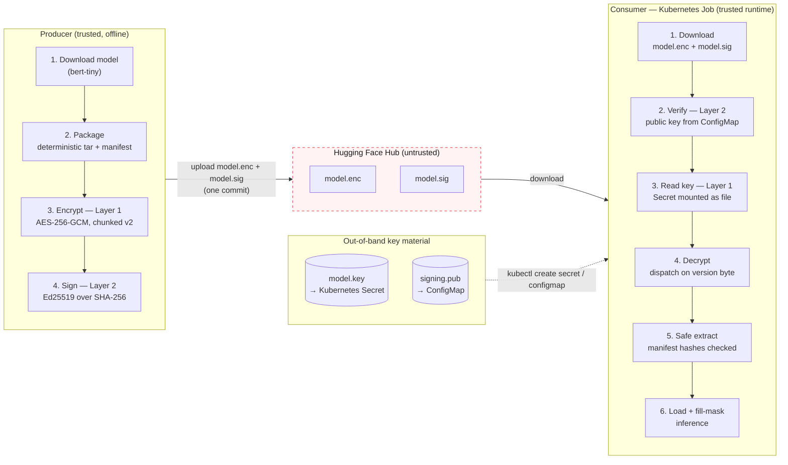

</details>

Key facts:

- Only `model.enc` and `model.sig` ever reach the Hub. Never the plaintext model,
  never a key.
- The consumer verifies the signature **before** it reads the decryption key. A
  tampered artifact never touches Layer 1.
- Keys travel on a separate path: the symmetric key as a Kubernetes Secret, the
  public signing key as a ConfigMap. The Hub is not a trust anchor.

## 2. Components


<details>
<summary>Mermaid source</summary>

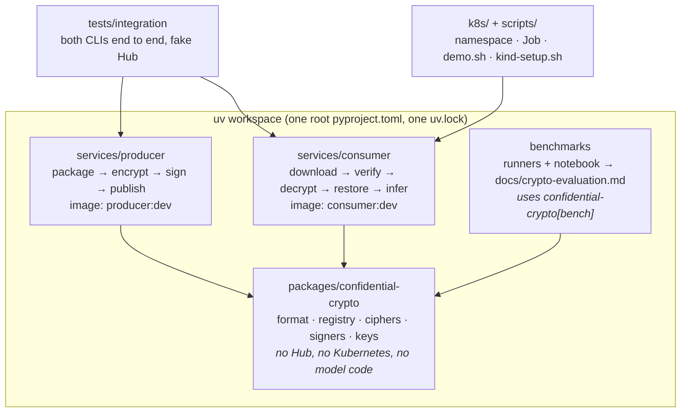

</details>

| Component | Responsibility | Ships in an image? |
|---|---|---|
| `confidential-crypto` | Encrypted artifact format (v1 one-shot, v2 chunked), signature envelope, algorithm registry, key loading. Identical bytes on both sides. | Yes, in both (without the `bench` extra) |
| `producer` | Downloads a Hub model, builds a deterministic tar, encrypts, signs, uploads. Reads keys from files the user names. | `producer:dev` |
| `consumer` | Fetches artifact + signature, verifies, decrypts, extracts safely, loads with Transformers, runs one fill-mask prompt. | `consumer:dev` (CPU-only torch) |
| `benchmarks` | Measures every candidate cipher, signer and mode; exports the decision record. | No |
| `tests/integration` | Full pipeline through the real CLIs with a fake Hub; synthetic 2-layer BERT by default, real `bert-tiny` under `-m slow`. | No |

### Internal layers of each service

Both services use the same layout. Dependencies point down only.


<details>
<summary>Mermaid source</summary>

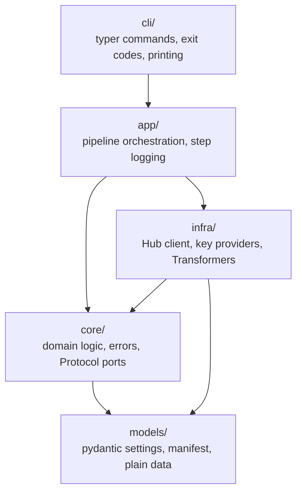

</details>

Why it matters for security:

- `infra/keys.py` is the **only** code that touches key bytes. Settings hold paths,
  never keys.
- `core/ports.py` defines `KeyProvider` and `ArtifactSource` as `Protocol`s. Tests
  inject fakes; Layer 3 can add `CdhKeyProvider` without touching the pipeline.
- `cli/` maps every `ConsumerError` subclass to a distinct exit code, so a failed
  Job is diagnosable from `kubectl` alone.

## 3. Data flow

### Producer

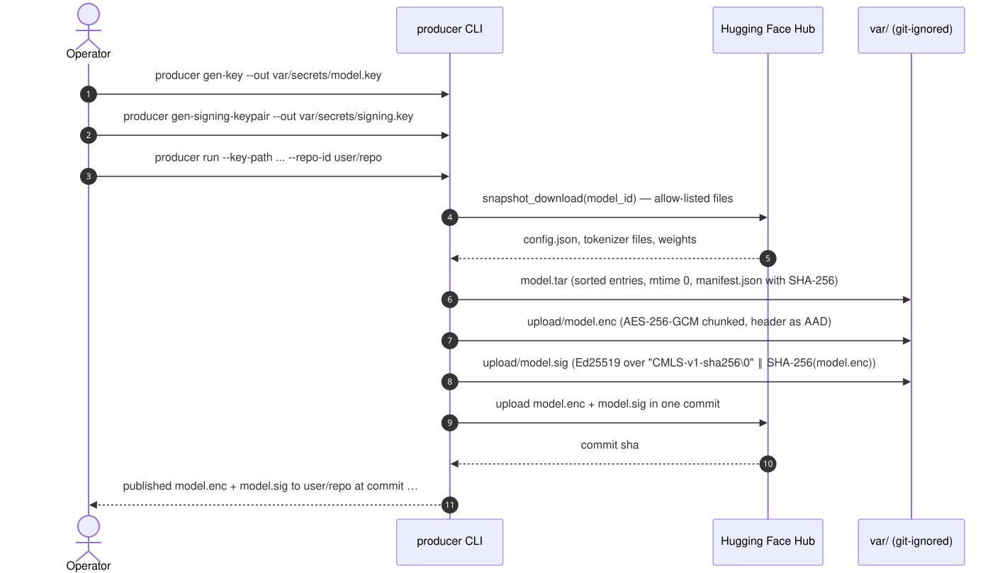

<details>
<summary>Mermaid source</summary>

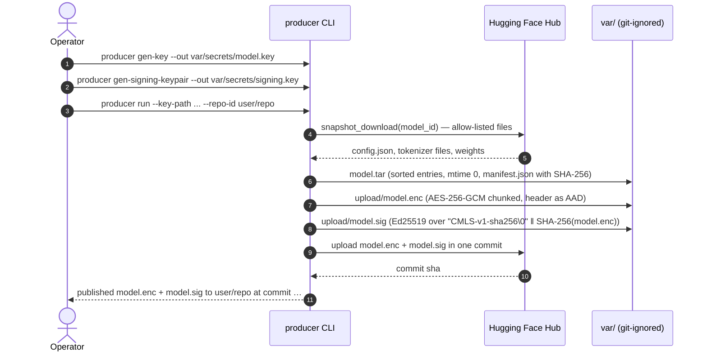

</details>

### Consumer

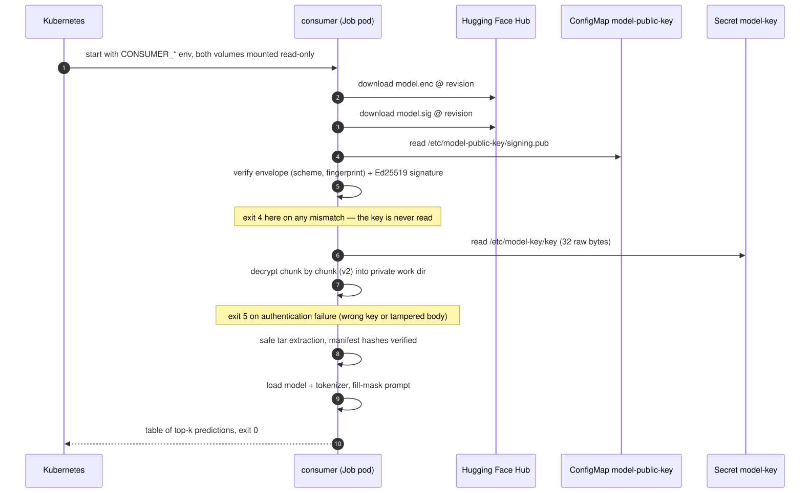

<details>
<summary>Mermaid source</summary>

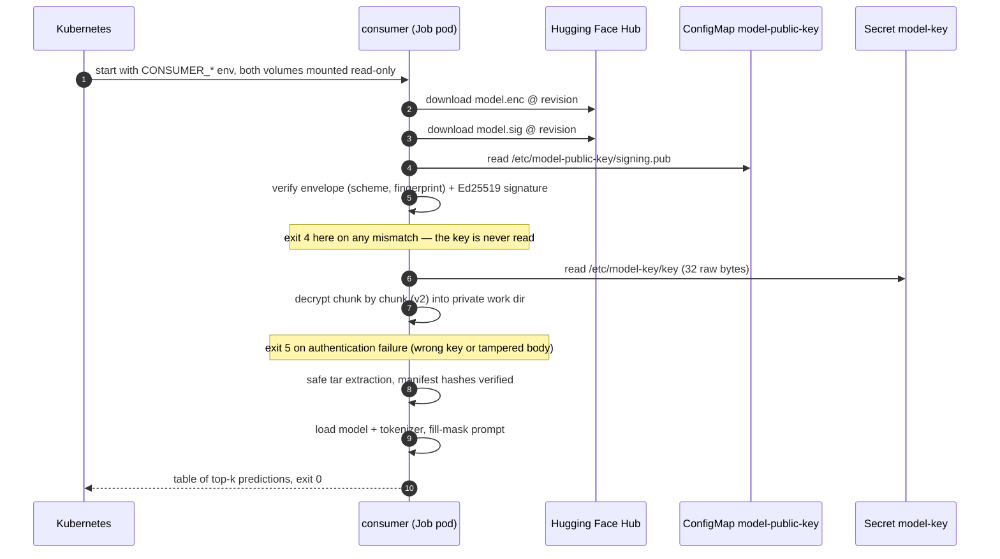

</details>

### Artifact format (shared package)

```text
Encrypted artifact, version 2 (chunked, STREAM construction) — production default:

  "CMLD" | ver=2 | cipher_id | prefix_len | nonce_prefix | chunk_size u32 | chunk_0 … chunk_last

  chunk_i = AEAD(key, nonce_i, plaintext_i, aad_i)
  nonce_i = nonce_prefix ‖ counter_i (u32) ‖ last_flag (u8)
  aad_i   = header ‖ counter_i ‖ last_flag

Encrypted artifact, version 1 (one-shot) — still accepted for small models:

  "CMLD" | ver=1 | cipher_id | nonce_len | nonce | ciphertext+tag

Signature envelope (published as model.sig):

  "CMLS" | ver=1 | scheme_id | key_fingerprint (SHA-256 of public key PEM) | sig_len | signature
```

The header is always associated data. Flipping `cipher_id` or the version fails
authentication instead of selecting another algorithm. The consumer dispatches on
the authenticated version byte, so the producer can change mode per artifact.

## 4. Trust boundaries


<details>
<summary>Mermaid source</summary>

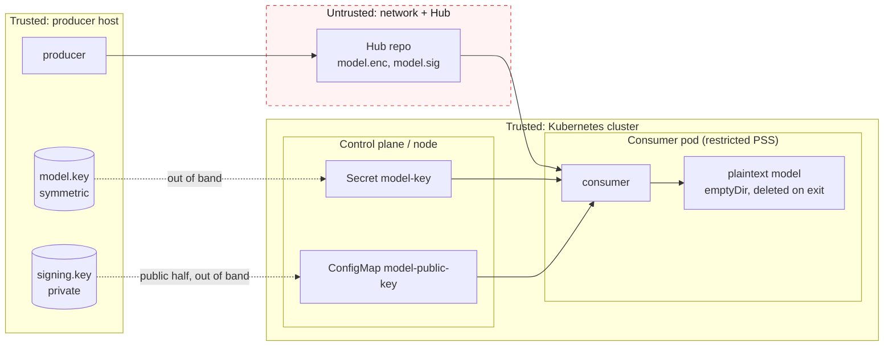

</details>

| Boundary | What crosses it | Protection |
|---|---|---|
| Producer → Hub | `model.enc`, `model.sig` | Confidentiality by Layer 1; integrity + authenticity by Layer 2 |
| Hub → Consumer | same two files | Verified before use; any change ⇒ exit 4 |
| Operator → Cluster | `model.key` (Secret), `signing.pub` (ConfigMap) | Kubernetes RBAC; Secret mounted `0400`, read-only, no service-account token |
| Cluster → Pod | key file, public key file | Pod cannot escalate: non-root, `readOnlyRootFilesystem`, all capabilities dropped |

### Threat model in one table

| Threat | Layer 1 | Layer 2 | Layer 3 (design only) |
|---|---|---|---|
| Hub operator or network reads the model | Blocked (encrypted) | — | Blocked |
| Hub operator swaps or corrupts `model.enc` | Detected at decrypt (AEAD tag) | Detected before decrypt (signature) | Detected |
| Attacker publishes a different encrypted model with the same key | Not detected | **Blocked** (no private signing key) | Blocked |
| Attacker replaces `model.sig` with their own | — | Blocked (public key from ConfigMap, not from the Hub) | Blocked |
| Cluster admin reads the Secret | **Not protected** — trust assumption | — | Blocked (key released only after attestation) |
| Compromised consumer process | Not protected (plaintext in memory) | Not protected | Partially (TEE memory encryption) |
| Stolen Hub token | Attacker can upload; consumer rejects (Layer 2) | Blocked | Blocked |

Assumptions we state openly:

- The Kubernetes control plane, the node and the cluster operators are trusted for
  Layer 1 and Layer 2.
- The producer host keeps `model.key` and `signing.key` secret. Rotation is a
  re-run of the producer plus a new Secret/ConfigMap.
- Plaintext exists inside the pod after decryption. It lives in an `emptyDir` and a
  private `0700` temp directory that is removed on exit.

## 5. Deployment topology


<details>
<summary>Mermaid source</summary>

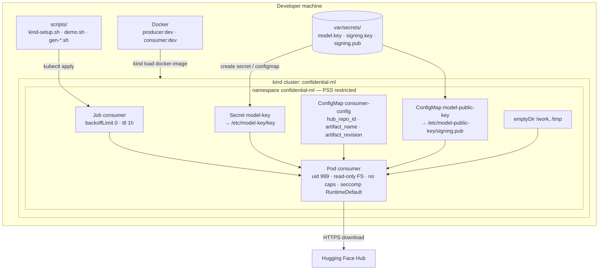

</details>

Runtime shape of the generated objects (nothing secret is committed; `demo.sh`
creates them on every run):

```yaml
# Secret (from var/secrets/model.key, 32 raw bytes)
apiVersion: v1
kind: Secret
metadata: { name: model-key, namespace: confidential-ml }
data: { key: <base64 of the key bytes> }
---
# ConfigMap: non-secret runtime configuration
apiVersion: v1
kind: ConfigMap
metadata: { name: consumer-config, namespace: confidential-ml }
data: { hub_repo_id: <user>/<repo>, artifact_name: model.enc, artifact_revision: main }
# optional keys: prompt, top_k (consumer defaults apply when absent)
---
# ConfigMap: Layer 2 trust anchor (rendered by scripts/gen-configmap-public-key.sh)
apiVersion: v1
kind: ConfigMap
metadata: { name: model-public-key, namespace: confidential-ml }
data: { signing.pub: "-----BEGIN PUBLIC KEY-----\n…" }
```

The producer image is built by `kind-setup.sh` but is not loaded into the cluster:
publishing runs on the operator's machine (or in CI), never inside the consumer
cluster.

## 6. Quality gates and CI


<details>
<summary>Mermaid source</summary>

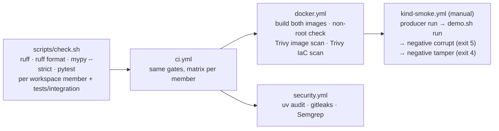

</details>

## 7. Design decisions (short form)

| Decision | Why |
|---|---|
| Separate producer / consumer projects | Different dependency graphs, images and trust roles. The consumer image never contains the Hub write path or the signing key logic. |
| One shared `confidential-crypto` package | The format and registry must be byte-identical on both sides. The package holds no Hub, Kubernetes or model code. |
| AES-256-GCM | Ranked #1 (4.8/5.0): fastest with AES-NI, standard, AEAD. One artifact per key keeps nonce risk trivial. |
| Ed25519 | Ranked #1 (4.4/5.0): deterministic, constant-time, 64-byte signatures, 32-byte keys. |
| Chunked mode (v2) as default | O(chunk) memory for multi-GB weights, same guarantees as one-shot, no measured throughput penalty. |
| Verify before decrypt, enforced by types | `decrypt_file` only accepts the `VerifiedArtifact` that `verify_file` returns. The mistake cannot compile. |
| Public key via ConfigMap, not the Hub | If the Hub could serve the trust anchor, Layer 2 would be circular. |
| Kubernetes Secret for the key | Exactly what the assignment asks; simple; a documented trust assumption that Layer 3 removes. |
| Registry with authenticated algorithm id | Agility without downgrade: the id is in the AAD, unknown or non-production ids abort. |
