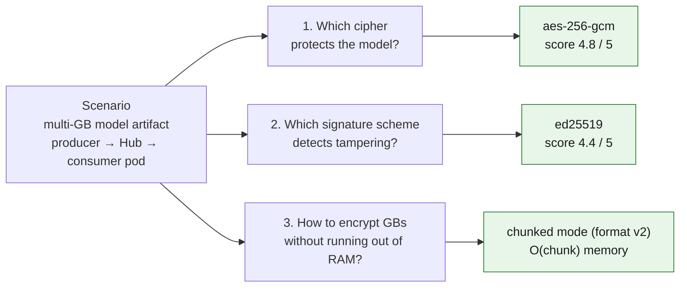
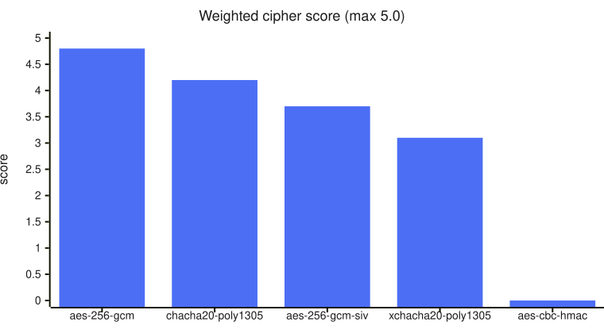
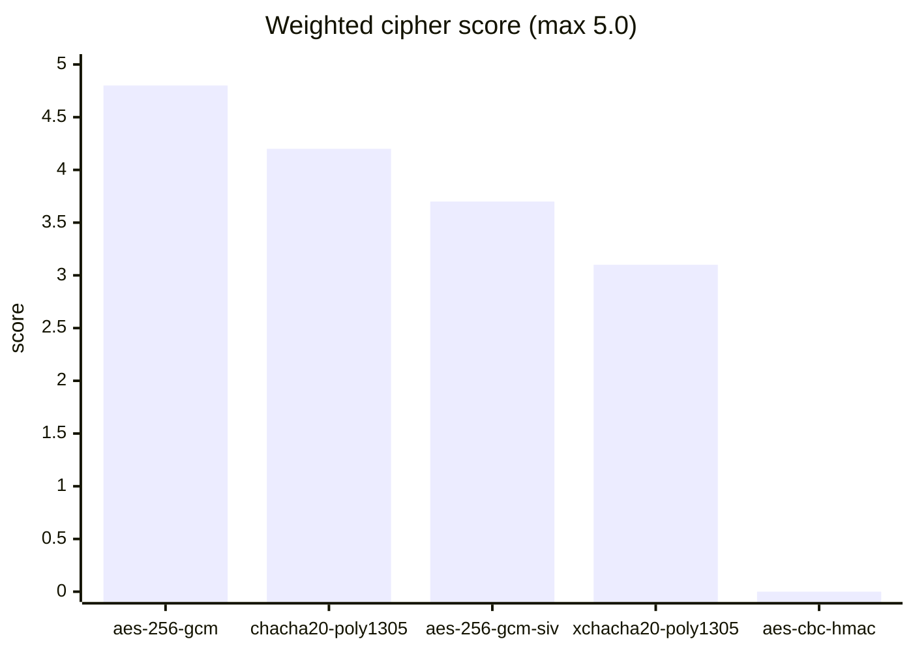
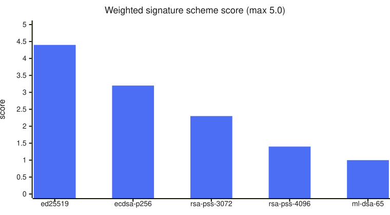
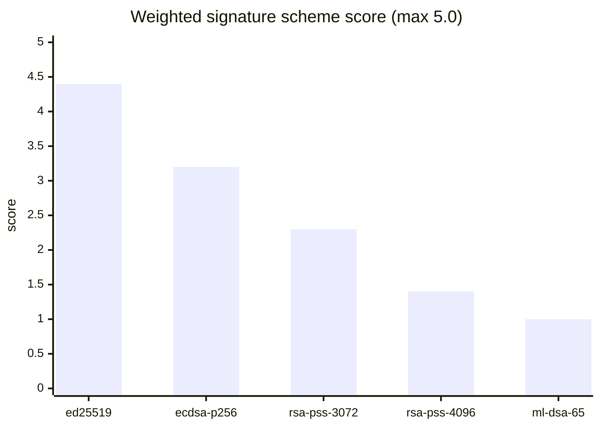
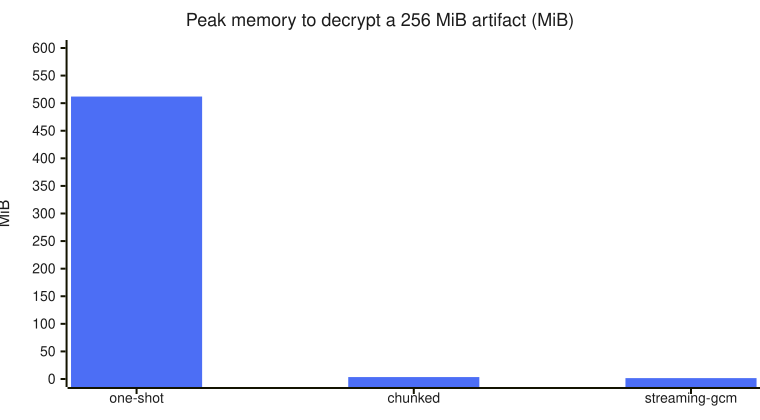
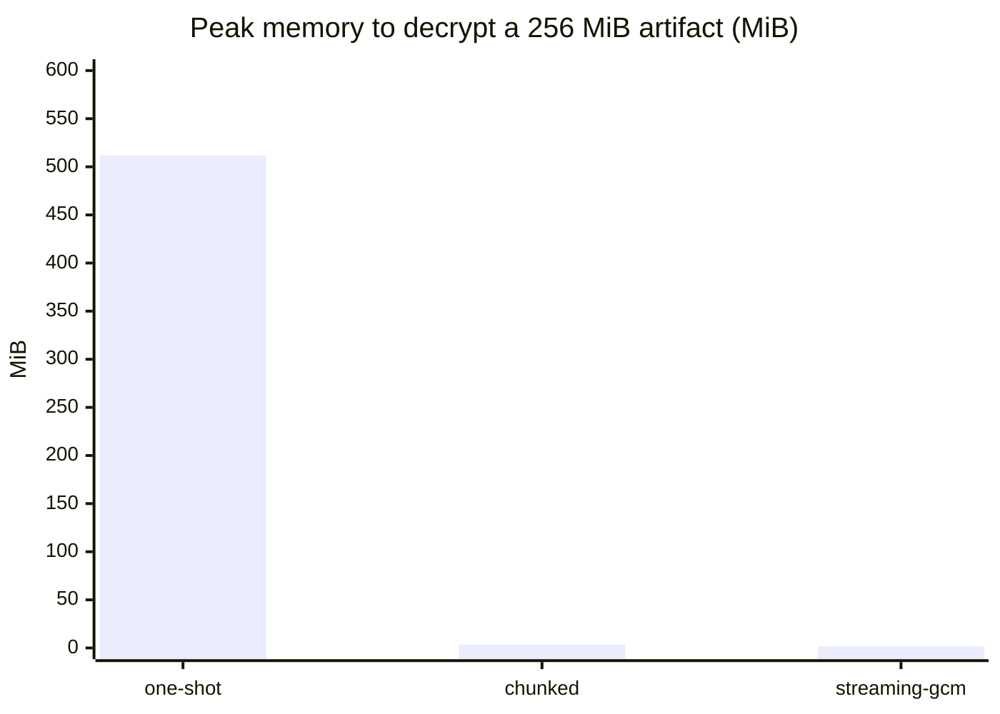
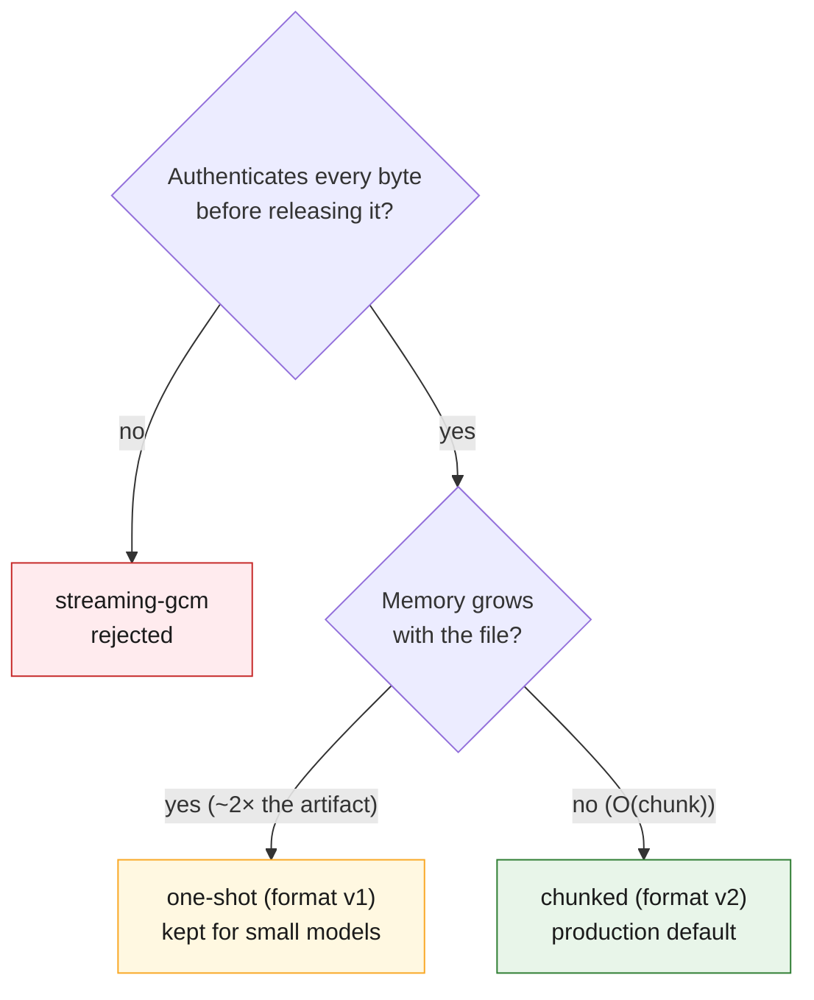

# Cryptography: decisions after the evaluation

Plain-language summary of what we decided after measuring every algorithm in
`confidential-crypto`. The full numbers, criteria and sources are in the formal
record [`crypto-evaluation.md`](crypto-evaluation.md); the code that produced them is
in `benchmarks/`.

## The scenario

We want to distribute encrypted LLM models. A **producer** encrypts and signs the
model; a **consumer** in Kubernetes downloads it, verifies the signature, gets the key
from a Secret, decrypts and loads the model. LLM weights are **gigabytes**, so there
are three questions:

Mermaid source

## What was measured

Every algorithm was run on files of 16, 64 and 256 MiB, several repetitions each:

- **Speed**: MiB per second encrypting and decrypting.
- **Memory**: how much RAM usage grows while encrypting and decrypting.
- **Overhead**: bytes added to the file (nonce + tag).
- **Security**: a 0–3 score per objective criterion, each with a source.

> CPU cost was not measured. Hardware acceleration and CPU tuning are out of scope;
> the focus is memory, because that is what limits a consumer pod.

## Ciphers (256 MiB files)

| Algorithm | Encrypt / decrypt | Memory | Pros | Cons |
|---|---|---|---|---|
| **aes-256-gcm** | ~1160 / ~1985 MiB/s | 768 MiB | de-facto standard (NIST), very fast with AES-NI, huge ecosystem | nonce reuse breaks everything; slow and not constant-time without AES-NI |
| **chacha20-poly1305** | ~890 / ~1290 MiB/s | 768 MiB | fast without special hardware, constant-time, TLS 1.3's plan B | same nonce problem; not on the FIPS list |
| **aes-256-gcm-siv** | ~480 / ~575 MiB/s | 768 MiB | nonce reuse almost harmless (only reveals equal messages) | slowest (two passes), little deployment, needs a recent OpenSSL |
| **xchacha20-poly1305** | ~645 / ~607 MiB/s | 1279 MiB | 192-bit nonce: accidental collisions practically impossible | no official RFC (expired draft), more memory, slower |
| **aes-256-cbc-hmac-sha256** | ~347 / ~532 MiB/s | 1279 MiB | none | home-made CBC+HMAC composition, source of the historic padding-oracle bugs; **not production-safe** |

Weighted ranking (speed ×1, memory ×0.5, security ×3):

Mermaid source

> **We chose `aes-256-gcm`**: the fastest and the most standard. Its only risk (the
> nonce) is under control here because only the producer encrypts, once per file.

## Signature schemes

| Scheme | Sign / verify | Public key / signature | Deterministic | Pros | Cons |
|---|---|---|---|---|---|
| **ed25519** | 36.7 / 19.5 ms | 113 B / 64 B | yes | nothing to get wrong with randomness, constant-time by design, tiny signatures, RFC 8032 / FIPS 186-5 | not post-quantum |
| **ecdsa-p256** | 8.1 / 8.5 ms | 178 B / 72 B | no | very fast, instant key generation | needs a secret nonce per signature: reuse leaks the private key (real cases: PS3, Bitcoin wallets) |
| **rsa-pss-3072** | 96.6 / 8.6 ms | 625 B / 384 B | no | very fast verification, decades of audit | big keys and signatures, key generation takes 320 ms |
| **rsa-pss-4096** | 211 / 8.3 ms | 800 B / 512 B | no | a bit more margin than 3072 | same but slower: 848 ms just to generate the key |
| **ml-dsa-65** | 31.5 / 30.6 ms | 2726 B / 3309 B | no | NIST post-quantum standard (Dilithium) | huge keys and signatures (~3 KB), new and lightly audited implementations |

Weighted ranking (sign ×0.5, verify ×1, size ×0.5, security ×3):

Mermaid source

> **We chose `ed25519`**: first in the ranking (4.4) and for the right reasons:
> deterministic, always constant-time, tiny signatures. The post-quantum gap is noted:
> `ml-dsa-65` is already registered, so a migration would be a configuration change,
> not a redesign.

## Encryption modes (how the cipher is applied to the file)

| Mode | Memory (256 MiB) encrypt / decrypt | File-to-file speed (aes-256-gcm) | Authenticates before releasing data? | Pros | Cons |
|---|---|---|---|---|---|
| **one-shot** | ~512 MiB | 626 / 578 MiB/s | yes | simplest code, all-or-nothing guarantee, 18/18 on the security table | memory grows with the file (~2×): not viable for GB weights |
| **chunked** | ~2.7 / ~3.5 MiB | 941 / 740 MiB/s | yes (per chunk) | flat memory always, same security as one-shot, and file to file it is not slower (measured faster) | format v2, one tag per chunk, more delicate logic (per-chunk nonce, last chunk, short reads) |
| **streaming-gcm** | ~1.5 / ~1.6 MiB | 698 / 643 MiB/s | **no** | minimal memory, format unchanged | releases plaintext before verifying: rejected for this use; only works with AES-GCM |

Mermaid source

## The big decision: chunked

One could argue for one-shot because it scores one point higher on the table (18 vs
17), but that point is all **code simplicity and format stability**, and the one thing
one-shot cannot give is exactly what we need: **constant memory**. A ~10 GB LLM would
force ~20 GB of RAM on the consumer with one-shot; nobody asks that of a Kubernetes pod.

**chunked** keeps memory flat at ~3–4 MiB whatever the model size, gives the same
security guarantees (every chunk is authenticated before it is written; truncation and
reordering are detected) and, measured file to file, **loses no performance**: in our
runs it even wins, because it avoids the huge buffers that cause page faults in
one-shot.

**streaming-gcm is rejected** even though it uses the least memory of all: it releases
data before checking the tag, and a consumer that loads the model straight from the
decrypted output cannot afford that. It stays in the evaluation as the documented
negative example.

Mermaid source

## Final decision

| Decision | Value | Why |
|---|---|---|
| Cipher | `aes-256-gcm` | fastest and most standard; the nonce risk is controllable (only the producer encrypts) |
| Signature | `ed25519` | deterministic, secure by design, tiny, #1 in the ranking |
| Mode | **chunked** | constant memory for GB weights, same security, no speed penalty |

The consumer picks the mode from the artifact's authenticated version byte, so
publishing in chunked mode breaks nothing: if one day it is useful (small model,
machine with spare RAM), one-shot is still there as an alternative.

## Risks that stay on record

- **Nonce**: GCM with a random nonce; since only the producer encrypts, once per file,
  the 2^32-messages-per-key bound does not apply.
- **Post-quantum**: confidentiality already resists quantum computers (256-bit key);
  the signature does not. `ml-dsa-65` is measured and registered in case we move to a
  hybrid scheme.
