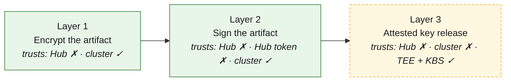
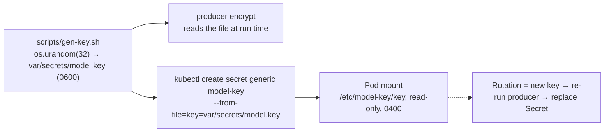
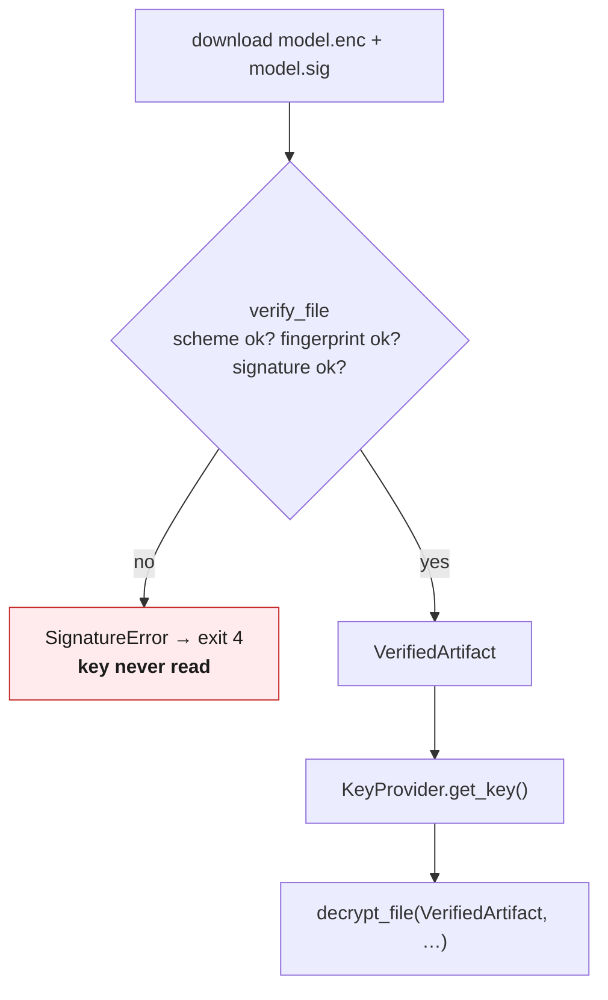
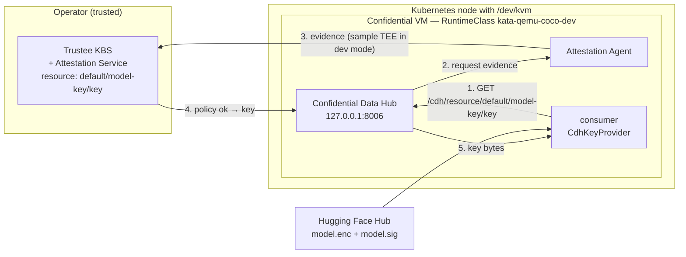

# Security layers

The assignment defines three layers. Each one removes a trust assumption of the
previous one. This document explains what each layer does, how it is implemented in
this repository, and what it does **not** protect.

| Layer | Goal | Mechanism | Status |
|---|---|---|---|
| **1 — Confidentiality** | Nobody outside the consumer can read the model | AES-256-GCM (chunked, format v2); key from a Kubernetes Secret | ✅ Implemented, tested, verified on kind |
| **2 — Authenticity** | The consumer only runs a model the producer signed | Ed25519 over SHA-256 of `model.enc`; verify before decrypt; public key from a ConfigMap | ✅ Implemented, tested, tamper demo |
| **3 — Attested key release** | Not even the cluster operator can read the key | Confidential Containers + Trustee KBS; key released after TEE attestation | 📝 Designed and assessed, not implemented |



<details>
<summary>Mermaid source</summary>



</details>

---

## Layer 1 — Encryption and key delivery

### What it protects

The model weights, config and tokenizer never exist in plaintext outside the
producer host and the consumer pod. The Hub, the network and anyone with read
access to the Hub repository only see ciphertext.

### Producer side

1. `producer package` downloads the model with an allow-list of files (config,
   tokenizer, weights) and writes a **deterministic tar**: sorted entries, `mtime 0`,
   `uid/gid 0`, relative paths only, plus `manifest.json` with the model id, revision
   and a SHA-256 per file. Same input ⇒ same tar bytes.
2. `producer encrypt` reads the key from the file the user names (`--key-path`),
   never from an environment variable, and writes `var/artifacts/upload/model.enc`.
   The upload directory only ever contains encrypted output.
3. The cipher is selected by name from configuration (`--cipher`, default
   `aes-256-gcm`) and the mode by `--mode` (default `chunked`).

### The artifact format

```text
v2 chunked (default):
  "CMLD" | 2 | cipher_id | prefix_len | nonce_prefix | chunk_size | chunk_0 … chunk_last
  chunk_i = AEAD(key, nonce_prefix ‖ i ‖ last_flag, plaintext_i, aad = header ‖ i ‖ last_flag)

v1 one-shot (still readable):
  "CMLD" | 1 | cipher_id | nonce_len | nonce | ciphertext + tag
```

Properties, all covered by tests in `packages/confidential-crypto/tests`:

| Property | How |
|---|---|
| Tamper detection | AEAD tag per chunk; a flipped byte anywhere fails authentication |
| No algorithm downgrade | The header (including `cipher_id`) is associated data |
| No reordering | The chunk counter is in both the nonce and the AAD |
| No truncation | The last chunk carries a `last_flag`; a missing tail is detected |
| No plaintext before auth | Each chunk is authenticated before it is written; `streaming-gcm` was rejected for breaking this |
| Flat memory | O(chunk) on both sides (default chunk 1 MiB); multi-GB weights fit in a 1–2 GiB pod |
| Nonce safety | Random 96-bit nonce / prefix per artifact; one artifact per key in practice |

### Consumer side

1. `FileKeyProvider` reads `/etc/model-key/key` — the Kubernetes Secret mounted as a
   read-only file (`defaultMode: 0400`). The key is 32 raw bytes or 64 hex chars.
2. `decrypt_file` reads the header, resolves the cipher through the registry, asks the
   provider for exactly `key_size` bytes and decrypts chunk by chunk into a private
   `0700` work directory.
3. `restore_package` extracts **regular files only** (absolute names, `..`, links,
   devices and files not listed in the manifest are rejected before anything is
   written) and re-hashes every file against `manifest.json`.
4. Transformers loads the directory; one fill-mask prompt runs; the work directory is
   deleted on exit.

### Key lifecycle



<details>
<summary>Mermaid source</summary>



</details>

Rules enforced in code and tests:

- Key bytes never appear in settings, logs, exceptions or `model_dump` output
  (`test_token_masked_and_key_never_present`).
- The producer refuses to publish anything from outside the upload directory; the
  plaintext tar and the key are never uploaded (`test_publish_refuses_plaintext`).
- `EnvKeyProvider` exists for local development only and is opt-in
  (`--key-source env`).

### Failure modes

| Situation | Consumer behaviour | Exit code |
|---|---|---|
| Secret missing | Pod never starts (`FailedMount`) | — |
| Secret has the wrong length | `ConfigError: key file … must be 32 raw bytes or 64 hex characters` | 2 |
| Wrong key of the right length | `DecryptError: authentication failed` | 5 |
| Artifact body modified (Layer 2 disabled) | `DecryptError: authentication failed` | 5 |
| Unknown or non-production cipher id | `DecryptError: unreadable artifact header` | 5 |
| Tar with `..` or a link | `ExtractionError` | 6 |

### What Layer 1 does not protect

- A cluster admin can read the Secret (`kubectl get secret -o yaml`). Layer 1 trusts
  the control plane. Layer 3 removes this.
- Anyone holding the same key can publish a *different* encrypted model that the
  consumer will happily run. Layer 2 removes this.
- Plaintext lives in pod memory and in a memory-backed `emptyDir` (tmpfs) during
  the Job; it is never written to the node's disk. The Hub download is ciphertext
  and stays in a disk-backed cache. Anyone who can read the node's memory can still
  read the loaded model; Layer 3 is the answer to that.

---

## Layer 2 — Signing and verification

### What it protects

The consumer only decrypts an artifact that was produced by the holder of the
signing private key. A swapped artifact, a swapped signature or a replayed
signature from another publish are all rejected **before** the decryption key is
read.

### Producer side

1. `scripts/gen-signing-keypair.sh` writes `var/secrets/signing.key` (PEM, `0600`)
   and `var/secrets/signing.pub`.
2. `producer sign` computes `SHA-256(model.enc)` in a stream, signs
   `"CMLS-v1-sha256\0" ‖ digest` with Ed25519 (domain-separated hash-then-sign, O(1)
   memory) and writes `model.sig` next to `model.enc`.
3. `producer publish` uploads `model.enc` **and** `model.sig` in one Hub commit. With
   signing enabled (the default) a missing or malformed signature aborts the publish,
   so an unsigned artifact never reaches the Hub by accident. `--no-sign` logs a
   warning.

Signature envelope:

```text
"CMLS" | 1 | scheme_id | key_fingerprint (SHA-256 of the public key PEM) | sig_len | signature
```

The fingerprint lets the consumer say "wrong public key" instead of a generic
verification failure.

### Consumer side



<details>
<summary>Mermaid source</summary>



</details>

- The public key comes from a **ConfigMap mounted at
  `/etc/model-public-key/signing.pub`**, generated from the producer's
  `signing.pub` by `scripts/gen-configmap-public-key.sh`. It is a trust anchor that
  does not travel through the Hub.
- The expected scheme is configuration (`--signer`, default `ed25519`). An envelope
  declaring another scheme is rejected even if it would verify.
- "Verify before decrypt" is enforced by types: `decrypt_file` only accepts the
  `VerifiedArtifact` value that `verify_file` returns. The only other way to obtain
  one is the explicit `--no-verify` escape hatch, which logs a warning and is meant
  for development only.

### Tests

Unit tests in both services plus `tests/integration/test_security.py`:

| Test | Expectation |
|---|---|
| Valid artifact + signature | verifies, decrypts, `france` top-1 |
| Modified artifact (header, body, tail) | exit 4, key never read |
| Modified signature bytes | exit 4 |
| Signature from another publish | exit 4 (fingerprint/digest mismatch) |
| Untrusted public key | exit 4 `expected public key …` |
| Scheme id mismatch, malformed envelope, missing `.sig` | exit 4 |
| Missing or non-PEM public key file | exit 2 |
| Wrong decryption key after a valid signature | exit 5 (Layer 1 still works) |
| Unsigned publish read by a verifying consumer | exit 4; refused at publish time when `sign` is on |

### The tamper demo

`scripts/demo.sh negative tamper`:

1. `scripts/publish-tampered.py` downloads `model.enc`, flips one byte and pushes it
   with the **original** `model.sig` to the `tampered` branch of the same repository.
2. The consumer Job is pinned to `artifact_revision=tampered` with the **real**
   Secret in place, so a decryption attempt would otherwise succeed.
3. The Job fails with exit 4, `signature verification failed: signature is invalid`,
   and the logs contain no "decrypted" line.

Verified locally on 2026-09-16 with the real `bert-tiny`; the kind run is part of
`.github/workflows/kind-smoke.yml`.

### What Layer 2 does not protect

- It does not hide anything: that is Layer 1.
- It does not stop a cluster admin who can edit the ConfigMap *and* the Secret from
  running their own model. The trust anchor lives inside the trusted cluster.
- A leaked signing private key is a full compromise of Layer 2: rotation means a new
  key pair, a re-sign and a new ConfigMap.

---

## Layer 3 — Attested key release (design and feasibility)

**Decision (2026-09-15): designed and assessed in documentation only. Not
implemented.** Layers 1 and 2 are complete, reproducible and tested; Layer 3 is
infrastructure-heavy and environment-sensitive, so it stays isolated from them.

### Goal

Replace the Kubernetes Secret with a key that is released **only** to a consumer
running inside a confidential VM whose attestation evidence satisfies a policy.
The cluster operator can no longer read the key: it never exists in the
Kubernetes API.

### Target architecture (Confidential Containers, development mode)



<details>
<summary>Mermaid source</summary>



</details>

Flow:

1. The Job runs with `runtimeClassName: kata-qemu-coco-dev`. Kata starts a VM
   around the pod; in dev mode the "TEE" is a sample attester, so it runs on any
   node with `/dev/kvm`.
2. The pod annotation
   `io.katacontainers.config.hypervisor.kernel_params: "agent.aa_kbc_params=cc_kbc::http://<kbs>:8080"`
   tells the guest agent where the KBS is.
3. The consumer's `CdhKeyProvider` calls
   `http://127.0.0.1:8006/cdh/resource/default/model-key/key` inside the VM.
4. The CDH asks the Attestation Agent for evidence, the KBS validates it against the
   policy and returns the key bytes to the CDH, which returns them to the consumer.
5. Everything after that is unchanged: verify (Layer 2), decrypt, extract, infer.

### Code design already in place

- `consumer.core.ports.KeyProvider` is a `Protocol`; the pipeline does not care where
  the key comes from.
- `consumer.infra.keys.CdhKeyProvider` exists as a documented stub that raises
  `ConfigError("… is not implemented")`. Implementing it is one HTTP GET plus the
  same `decode_symmetric_key` validation the other providers use.
- Configuration would add `key_source: cdh` and `cdh_resource_path`; no key bytes in
  settings, as today.

### Manifests skeleton (not applied anywhere)

```yaml
# k8s/layer3/consumer-job-coco.yaml — sketch
apiVersion: batch/v1
kind: Job
metadata: { name: consumer-coco, namespace: confidential-ml }
spec:
  template:
    metadata:
      annotations:
        io.katacontainers.config.hypervisor.kernel_params: "agent.aa_kbc_params=cc_kbc::http://kbs.trustee.svc:8080"
    spec:
      runtimeClassName: kata-qemu-coco-dev
      restartPolicy: Never
      containers:
        - name: consumer
          image: <registry>/consumer:dev      # must be pullable from inside the VM
          env:
            - { name: CONSUMER_KEY_SOURCE, value: cdh }
            - { name: CONSUMER_CDH_RESOURCE_PATH, value: default/model-key/key }
            - { name: CONSUMER_PUBLIC_KEY_PATH, value: /etc/model-public-key/signing.pub }
          volumeMounts:
            - { name: model-public-key, mountPath: /etc/model-public-key, readOnly: true }
      volumes:
        - name: model-public-key
          configMap: { name: model-public-key }
```

Operator steps, in order: install the CoCo operator → deploy Trustee (KBS +
attestation service) → upload the key as resource `default/model-key/key` → set a
permissive policy for the sample attester → apply the Job.

### Feasibility assessment

| Constraint | Impact |
|---|---|
| Needs a node with `/dev/kvm` | **`kind` is not sufficient.** Nodes are containers; nested virtualisation is required. A bare-metal or VM-with-nested-virt cluster (e.g. a single-node `kubeadm` on a Linux host with KVM) is the minimum. |
| CoCo operator + Kata runtime | Adds a privileged DaemonSet and a RuntimeClass to the cluster; the restricted PSS namespace would need review. |
| Trustee KBS | Another service to deploy and secure; in dev mode it accepts the sample attester's evidence, so it proves the **flow**, not hardware guarantees. |
| Permissive policy caveat | A permissive policy releases the key to any client that completes the sample flow. It is a demo, not production security. |
| Image pull inside the VM | `kind load` does not reach the guest. The image must come from a registry. |
| `readOnlyRootFilesystem`, `emptyDir` sizes | Inside the VM the guest memory bounds the writable space; the plaintext model must fit. |
| Layer 1/2 independence | Nothing above changes the artifact format, the signature or the pipeline order. Layer 3 is a new `KeyProvider` plus manifests. |

Verdict: feasible as a follow-up on suitable hardware; out of scope for the
mandatory submission, which the assignment allows.

---

## Where each guarantee is enforced

| Guarantee | Code | Test |
|---|---|---|
| Header authenticated | `confidential_crypto/format.py`, `artifact.py` | `test_format.py`, `test_chunked.py` |
| Verify before decrypt | `consumer/core/verify.py`, `core/decrypt.py` (types) | `test_tampered_artifact_is_never_decrypted`, `tests/integration/test_security.py` |
| Key bytes isolated | `consumer/infra/keys.py`, `producer/infra/keys.py` | `test_token_masked_and_key_never_present`, `test_gen_key_never_prints_key` |
| Safe extraction | `consumer/core/extract.py` | `test_unsafe_members_are_rejected` |
| Only encrypted files uploaded | `producer/app/pipeline.py::run_publish` | `test_publish_refuses_plaintext` |
| Distinct exit codes | `consumer/core/errors.py` | CLI exit-code tests |
